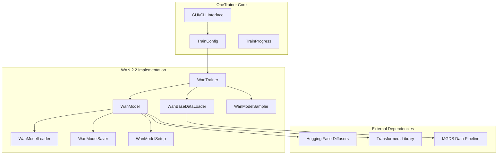

# Design Document

## Overview

This design document outlines the technical approach for integrating WAN 2.2 (World Animator Network 2.2) support into OneTrainer. WAN 2.2 is a video generation diffusion model that requires specialized handling for video data, temporal consistency, and 3D transformer architectures.

The implementation follows OneTrainer's modular architecture pattern, creating WAN 2.2-specific implementations of each required module type while maintaining compatibility with existing training workflows, UI components, and configuration systems. The design supports both CUDA (NVIDIA) and ROCm (AMD) GPU acceleration platforms for broad hardware compatibility.

## Architecture

### High-Level Architecture



### Module Integration Pattern

WAN 2.2 follows OneTrainer's established module pattern:

1. **Model Module** (`modules/model/WanModel.py`): Core model wrapper containing WAN 2.2 components
2. **Model Loader** (`modules/modelLoader/wan/`): Loading WAN 2.2 models from various formats
3. **Model Saver** (`modules/modelSaver/wan/`): Saving trained WAN 2.2 models
4. **Model Setup** (`modules/modelSetup/wan/`): Training configuration and optimization setup
5. **Data Loader** (`modules/dataLoader/WanBaseDataLoader.py`): Video data processing pipeline
6. **Model Sampler** (`modules/modelSampler/wan/`): Video generation during training
7. **Trainer** (`modules/trainer/wan/`): Training loop orchestration

## Components and Interfaces

### WanModel Class

The core model class inheriting from `BaseModel`:

```python
class WanModel(BaseModel):
    # Core WAN 2.2 components
    tokenizer: PreTrainedTokenizer | None
    text_encoder: PreTrainedModel | None
    vae: AutoencoderKL | None
    transformer: WanTransformer3DModel | None
    noise_scheduler: FlowMatchEulerDiscreteScheduler | None
    
    # Training-specific components
    embedding: WanModelEmbedding | None
    additional_embeddings: list[WanModelEmbedding]
    text_encoder_lora: LoRAModuleWrapper | None
    transformer_lora: LoRAModuleWrapper | None
    
    # Video-specific properties
    frame_count: int
    temporal_compression: int
    spatial_compression: int
```

### WanModelEmbedding Class

Embedding wrapper for textual inversion training:

```python
class WanModelEmbedding:
    def __init__(
        self,
        uuid: str,
        text_encoder_vector: Tensor | None,
        placeholder: str,
        is_output_embedding: bool,
    ):
        self.text_encoder_embedding = BaseModelEmbedding(
            uuid=uuid,
            placeholder=placeholder,
            vector=text_encoder_vector,
            is_output_embedding=is_output_embedding,
        )
```

### WanBaseDataLoader Class

Video data processing pipeline:

```python
class WanBaseDataLoader(BaseDataLoader, DataLoaderText2VideoMixin):
    def _preparation_modules(self, config: TrainConfig, model: WanModel):
        # Video preprocessing pipeline
        # - Frame extraction and sampling
        # - Temporal consistency handling
        # - VAE encoding for video latents
        # - Text encoding for prompts
        pass
```

### Model Type Extensions

Extension to `ModelType` enum:

```python
class ModelType(Enum):
    # ... existing types ...
    WAN_2_2 = 'WAN_2_2'
    
    def is_wan(self):
        return self == ModelType.WAN_2_2
    
    def is_video_model(self):
        return self.is_hunyuan_video() or self.is_wan()
    
    def is_flow_matching(self) -> bool:
        return (self.is_stable_diffusion_3() or 
                self.is_flux() or 
                self.is_chroma() or 
                self.is_qwen() or 
                self.is_sana() or 
                self.is_hunyuan_video() or 
                self.is_hi_dream() or 
                self.is_wan())
```

## Data Models

### Video Data Structure

WAN 2.2 requires specialized video data handling:

```python
@dataclass
class VideoSample:
    frames: List[torch.Tensor]  # List of frame tensors
    prompt: str                 # Text description
    frame_count: int           # Number of frames
    fps: float                 # Frames per second
    resolution: Tuple[int, int] # Width, height
    duration: float            # Video duration in seconds
```

### Training Configuration

WAN 2.2-specific training parameters:

```python
@dataclass
class WanTrainConfig:
    # Video-specific parameters
    max_frames: int = 16
    frame_sample_strategy: str = "uniform"  # uniform, random, keyframe
    temporal_consistency_weight: float = 1.0
    
    # Model-specific parameters
    transformer_layers_to_train: List[int] = None
    use_temporal_attention: bool = True
    spatial_compression_ratio: int = 8
    temporal_compression_ratio: int = 4
```

### Model Specifications

JSON specifications for WAN 2.2 variants:

**`resources/sd_model_spec/wan_2_2.json`**:
```json
{
    "modelspec.sai_model_spec": "1.0.0",
    "modelspec.architecture": "WAN-2.2",
    "modelspec.implementation": "https://github.com/huggingface/diffusers",
    "modelspec.title": "WAN 2.2"
}
```

**`resources/sd_model_spec/wan_2_2-lora.json`**:
```json
{
    "modelspec.sai_model_spec": "1.0.0",
    "modelspec.architecture": "WAN-2.2/lora",
    "modelspec.implementation": "https://github.com/huggingface/diffusers",
    "modelspec.title": "WAN 2.2 LoRA"
}
```

## Error Handling

### Model Loading Errors

- **Missing Dependencies**: Check for required diffusers version and WAN 2.2 model availability
- **Incompatible Model Format**: Validate model architecture and provide conversion utilities
- **Memory Constraints**: Implement model offloading and gradient checkpointing for large video models

### Training Errors

- **Video Data Validation**: Ensure consistent frame counts, resolutions, and formats
- **Temporal Consistency**: Handle frame sequence errors and temporal alignment issues
- **Memory Management**: Implement video batch processing with memory-efficient strategies

### Sampling Errors

- **Generation Failures**: Provide fallback sampling strategies and error recovery
- **Format Compatibility**: Ensure generated videos are saved in standard formats (MP4, WebM)

## Testing Strategy

### Unit Tests

1. **Model Component Tests**:
   - WanModel initialization and device movement
   - Text encoding and video latent processing
   - LoRA adapter functionality

2. **Data Pipeline Tests**:
   - Video loading and preprocessing
   - Frame sampling strategies
   - Batch processing validation

3. **Training Loop Tests**:
   - Forward pass validation
   - Loss computation accuracy
   - Gradient flow verification

### Integration Tests

1. **End-to-End Training**:
   - Complete training workflow with synthetic data
   - Model saving and loading consistency
   - Configuration persistence

2. **Sampling Integration**:
   - Video generation during training
   - Output format validation
   - Quality metrics computation

### Nix Environment Testing

1. **Environment Compatibility**:
   - Dependency resolution in Nix environment
   - Virtual environment isolation
   - Package version consistency

2. **Multi-Platform GPU Testing**:
   - ROCm acceleration validation on AMD GPUs
   - CUDA acceleration validation on NVIDIA GPUs
   - CPU fallback testing for development environments
   - Cross-platform PyTorch compatibility

3. **Hardware-Agnostic Testing**:
   - Model loading without GPU requirements
   - Basic functionality validation
   - Configuration file processing

### Performance Tests

1. **Memory Usage**:
   - Peak memory consumption during training
   - Memory efficiency of video batching
   - Model offloading effectiveness

2. **Training Speed**:
   - Steps per second benchmarking
   - Batch size scaling analysis
   - Comparison with existing video models

## Implementation Phases

### Phase 1: Core Model Implementation
- Implement WanModel class and basic components
- Add WAN_2_2 to ModelType enum
- Create basic model specifications

### Phase 2: Data Pipeline
- Implement WanBaseDataLoader for video processing
- Add video data validation and preprocessing
- Integrate with MGDS pipeline system

### Phase 3: Training Integration
- Implement WanModelSetup for training configuration
- Add WAN 2.2 support to training loops
- Implement LoRA support for WAN 2.2

### Phase 4: Model I/O
- Implement WanModelLoader for various formats
- Implement WanModelSaver for trained models
- Add conversion utilities between formats

### Phase 5: Sampling and UI
- Implement WanModelSampler for video generation
- Add WAN 2.2 options to GUI and CLI interfaces
- Integrate with existing sampling workflows

### Phase 6: Testing and Optimization
- Comprehensive testing in Nix environment
- Performance optimization and memory management
- Documentation and example configurations

## Dependencies

### Required Libraries

- **diffusers**: Latest version with WAN 2.2 support
- **transformers**: For text encoder components
- **torch**: PyTorch framework with ROCm or CUDA support
- **torchvision**: Video processing utilities
- **opencv-python**: Video I/O operations
- **pillow**: Image processing
- **numpy**: Numerical operations

### Platform-Specific Dependencies

- **ROCm (AMD GPUs)**: PyTorch with ROCm support for AMD GPU acceleration
- **CUDA (NVIDIA GPUs)**: PyTorch with CUDA support for NVIDIA GPU acceleration
- **CPU**: Standard PyTorch CPU version for development and testing

### Optional Dependencies

- **xformers**: Memory-efficient attention (if available)
- **flash-attn**: Flash attention implementation
- **bitsandbytes**: Quantization support

### Development Dependencies

- **pytest**: Unit testing framework
- **pytest-mock**: Mocking utilities
- **black**: Code formatting
- **flake8**: Code linting

## Configuration Schema

### Training Configuration Extensions

```yaml
# WAN 2.2 specific configuration
wan_config:
  max_frames: 16
  frame_sample_strategy: "uniform"
  temporal_consistency_weight: 1.0
  use_temporal_attention: true
  spatial_compression_ratio: 8
  temporal_compression_ratio: 4

# Video data configuration
video_data:
  supported_formats: ["mp4", "avi", "mov", "webm"]
  target_fps: 24
  max_duration: 10.0  # seconds
  min_resolution: [256, 256]
  max_resolution: [1024, 1024]
```

This design provides a comprehensive foundation for implementing WAN 2.2 support in OneTrainer while maintaining architectural consistency and enabling all required training modes including full fine-tuning, LoRA, and embedding training.