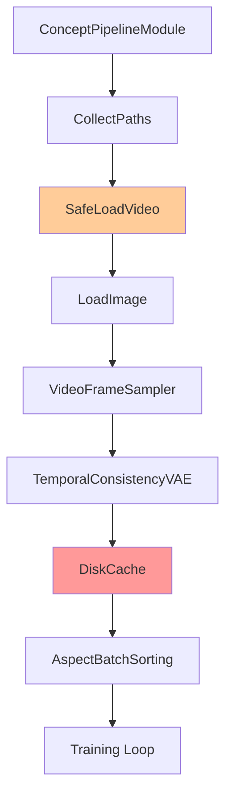
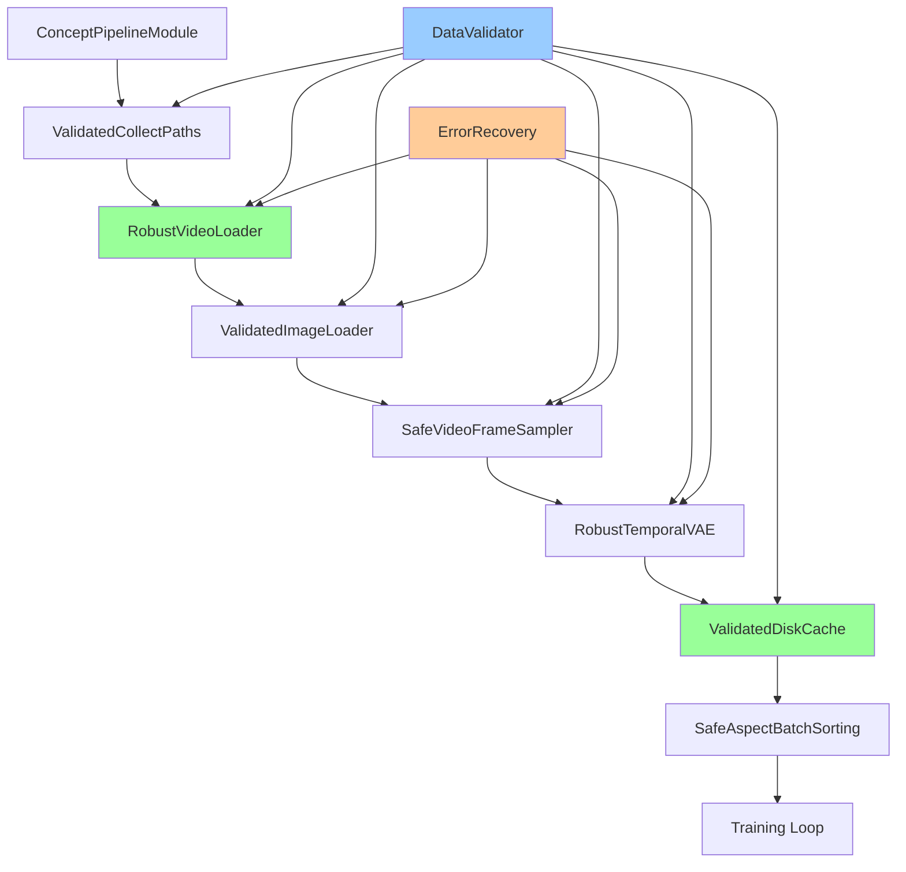

# Design Document: WAN Training Pipeline Fixes

## Overview

This design addresses critical data pipeline failures in the WAN 2.2 OneTrainer implementation that cause training to crash with `TypeError: 'NoneType' object is not subscriptable` errors. The root cause is insufficient error handling and data validation in the MGDS (Multi-GPU Data System) pipeline, particularly in the DiskCache module where None values propagate through the data flow without proper validation.

The solution implements a comprehensive defensive programming approach with robust error handling, data validation, and recovery mechanisms throughout the video data processing pipeline.

## Architecture

### Current Pipeline Flow


### Enhanced Pipeline Flow


## Components and Interfaces

### 1. Enhanced SafePipelineModule

**Purpose**: Provides comprehensive error handling and data validation for all pipeline modules.

**Key Features**:
- None value detection and handling
- Type validation for data items
- Graceful error recovery with fallback values
- Detailed logging and debugging information
- Circuit breaker pattern for cascading failure prevention

**Interface**:
```python
class EnhancedSafePipelineModule(PipelineModule):
    def __init__(self, wrapped_module: PipelineModule, module_name: str, 
                 fallback_strategy: str = "skip", max_failures: int = 10)
    def validate_item(self, item: Any, expected_type: type) -> bool
    def handle_none_item(self, item_name: str, index: int) -> Any
    def get_fallback_value(self, item_name: str, expected_type: type) -> Any
    def should_skip_sample(self, failure_count: int) -> bool
```

### 2. DataFlowValidator

**Purpose**: Validates data integrity at pipeline boundaries and provides detailed diagnostics.

**Key Features**:
- Pre-processing validation of input data
- Post-processing validation of output data
- Data shape and type checking
- Memory usage monitoring
- Performance metrics collection

**Interface**:
```python
class DataFlowValidator:
    def validate_video_file(self, video_path: str) -> ValidationResult
    def validate_pipeline_item(self, item: Dict, expected_schema: Dict) -> bool
    def check_memory_usage(self) -> MemoryStats
    def log_pipeline_metrics(self, module_name: str, processing_time: float)
```

### 3. RobustVideoLoader

**Purpose**: Handles video loading with comprehensive error recovery and validation.

**Key Features**:
- Video file integrity checking
- Format compatibility validation
- Graceful handling of corrupted files
- Automatic fallback to alternative processing methods
- Detailed error reporting

**Interface**:
```python
class RobustVideoLoader:
    def load_video_safe(self, video_path: str, target_frames: int) -> Optional[torch.Tensor]
    def validate_video_metadata(self, video_path: str) -> VideoMetadata
    def handle_video_error(self, video_path: str, error: Exception) -> Optional[torch.Tensor]
    def get_video_fallback(self, video_path: str) -> torch.Tensor
```

### 4. ValidatedDiskCache

**Purpose**: Enhanced DiskCache with robust error handling and data validation.

**Key Features**:
- Pre-cache data validation
- Safe item access with None checking
- Automatic cache corruption recovery
- Detailed cache statistics and monitoring
- Graceful degradation when caching fails

**Interface**:
```python
class ValidatedDiskCache(DiskCache):
    def validate_cache_item(self, item: Dict) -> bool
    def safe_get_previous_item(self, variation: int, name: str, index: int) -> Any
    def handle_cache_corruption(self, cache_path: str) -> bool
    def get_cache_statistics(self) -> CacheStats
```

### 5. ErrorRecoveryManager

**Purpose**: Centralized error handling and recovery coordination across the pipeline.

**Key Features**:
- Error classification and prioritization
- Recovery strategy selection
- Failure pattern detection
- Performance impact monitoring
- Automatic pipeline reconfiguration

**Interface**:
```python
class ErrorRecoveryManager:
    def classify_error(self, error: Exception, context: Dict) -> ErrorType
    def select_recovery_strategy(self, error_type: ErrorType) -> RecoveryStrategy
    def should_retry_operation(self, operation: str, failure_count: int) -> bool
    def reconfigure_pipeline(self, failure_patterns: List[FailurePattern])
```

## Data Models

### ValidationResult
```python
@dataclass
class ValidationResult:
    is_valid: bool
    error_message: Optional[str]
    warnings: List[str]
    metadata: Dict[str, Any]
    processing_time: float
```

### VideoMetadata
```python
@dataclass
class VideoMetadata:
    width: int
    height: int
    fps: float
    duration: float
    frame_count: int
    format: str
    codec: str
    is_corrupted: bool
    error_details: Optional[str]
```

### CacheStats
```python
@dataclass
class CacheStats:
    hit_rate: float
    miss_rate: float
    corruption_count: int
    total_items: int
    cache_size_mb: float
    avg_access_time: float
```

### MemoryStats
```python
@dataclass
class MemoryStats:
    current_usage_mb: float
    peak_usage_mb: float
    available_mb: float
    gpu_usage_mb: Optional[float]
    swap_usage_mb: float
```

## Correctness Properties

*A property is a characteristic or behavior that should hold true across all valid executions of a system-essentially, a formal statement about what the system should do. Properties serve as the bridge between human-readable specifications and machine-verifiable correctness guarantees.*

### Converting EARS to Properties

Based on the prework analysis, I'll convert the acceptance criteria into testable properties, focusing on the most critical and non-redundant properties:

**Property 1: Pipeline Error Recovery**
*For any* pipeline module and any error condition, when an error occurs during data processing, the system should log the error with detailed context, attempt recovery or skip the problematic sample, and continue processing remaining samples without crashing.
**Validates: Requirements 1.1, 1.3, 4.1**

**Property 2: Data Validation Integrity**
*For any* pipeline stage and any data item, the system should validate data integrity (including None checking and type validation) before processing and prevent None values from propagating to subsequent stages.
**Validates: Requirements 1.4, 2.4, 5.1, 5.4**

**Property 3: Error Diagnostic Completeness**
*For any* validation failure or pipeline error, the system should identify and log the specific module, data item, and failure cause with sufficient detail for debugging.
**Validates: Requirements 1.2, 1.5, 2.2**

**Property 4: Video Processing Resilience**
*For any* video file (valid or invalid), the system should validate file integrity, handle loading failures gracefully by skipping invalid files, and continue processing with clear feedback about success/failure status.
**Validates: Requirements 3.1, 3.2, 3.3, 3.5**

**Property 5: Pipeline Logging Completeness**
*For any* pipeline module execution, the system should log input/output item names and types, data flow tracing information, and video processing details with sufficient completeness for debugging.
**Validates: Requirements 2.1, 2.3, 2.5**

**Property 6: Circuit Breaker Activation**
*For any* sequence of pipeline errors exceeding the failure threshold, the system should activate circuit breaker patterns to prevent cascading failures while maintaining overall training progress.
**Validates: Requirements 4.2, 4.3**

**Property 7: Metrics Collection Accuracy**
*For any* training session, the system should accurately track and report processing statistics including sample counts, processing times, memory usage, and cache performance metrics.
**Validates: Requirements 6.1, 6.2, 6.3, 6.4**

**Property 8: Safe Data Access Patterns**
*For any* data access operation, the system should use safe dictionary access patterns with default values, implement proper type checking, and preserve exception context for debugging.
**Validates: Requirements 5.2, 5.3, 5.5**

## Error Handling

### Error Classification

**Critical Errors** (Stop Training):
- Model loading failures
- GPU memory exhaustion
- Corrupted cache that cannot be recovered

**Recoverable Errors** (Skip and Continue):
- Individual video file corruption
- Single sample processing failures
- Transient network issues during model download

**Warning Conditions** (Log and Continue):
- Video format compatibility issues
- Missing optional metadata
- Performance degradation

### Recovery Strategies

**Skip Strategy**: Used for individual sample failures
- Log the failure with full context
- Mark sample as skipped in statistics
- Continue with next sample

**Retry Strategy**: Used for transient failures
- Implement exponential backoff
- Maximum 3 retry attempts
- Fall back to skip if retries exhausted

**Fallback Strategy**: Used for format/compatibility issues
- Use default values for missing metadata
- Convert unsupported formats when possible
- Graceful degradation of quality if needed

**Circuit Breaker Strategy**: Used for cascading failures
- Track failure rate per module
- Open circuit when failure rate > 50%
- Attempt recovery after cooldown period

## Testing Strategy

### Dual Testing Approach

The implementation will use both unit tests and property-based tests to ensure comprehensive coverage:

**Unit Tests**: Focus on specific examples, edge cases, and integration points
- Test specific error scenarios with known inputs
- Validate error message formats and content
- Test recovery mechanisms with controlled failures
- Verify logging output for specific cases

**Property-Based Tests**: Verify universal properties across all inputs
- Generate random video files with various corruption patterns
- Test pipeline behavior with random data structures
- Verify error handling across all possible failure modes
- Validate metrics accuracy with diverse processing scenarios

**Property Test Configuration**:
- Minimum 100 iterations per property test
- Use Hypothesis for Python property-based testing
- Each test tagged with: **Feature: wan-training-pipeline-fixes, Property {number}: {property_text}**

### Test Data Generation

**Video Test Data**:
- Valid videos with various formats, resolutions, frame rates
- Corrupted videos with different types of corruption
- Empty files, truncated files, invalid headers
- Videos with missing or malformed metadata

**Pipeline State Generation**:
- Random data structures with None values at various positions
- Invalid data types in expected positions
- Missing required fields in data dictionaries
- Corrupted cache files and recovery scenarios

### Integration Testing

**End-to-End Pipeline Tests**:
- Complete training pipeline with mixed valid/invalid data
- Memory pressure testing with large video datasets
- Concurrent processing with multiple data loader threads
- Cache corruption and recovery scenarios

**Performance Testing**:
- Throughput measurement under various error conditions
- Memory usage monitoring during error recovery
- Cache performance with different failure patterns
- Training progress continuity during sample failures

### Monitoring and Observability

**Real-time Metrics**:
- Error rates by module and error type
- Processing throughput and latency
- Memory usage patterns
- Cache hit/miss ratios

**Diagnostic Logging**:
- Structured logging with consistent format
- Error context preservation
- Data flow tracing capabilities
- Performance profiling integration

**Alerting**:
- High error rate detection
- Memory usage threshold alerts
- Training progress stall detection
- Cache corruption notifications